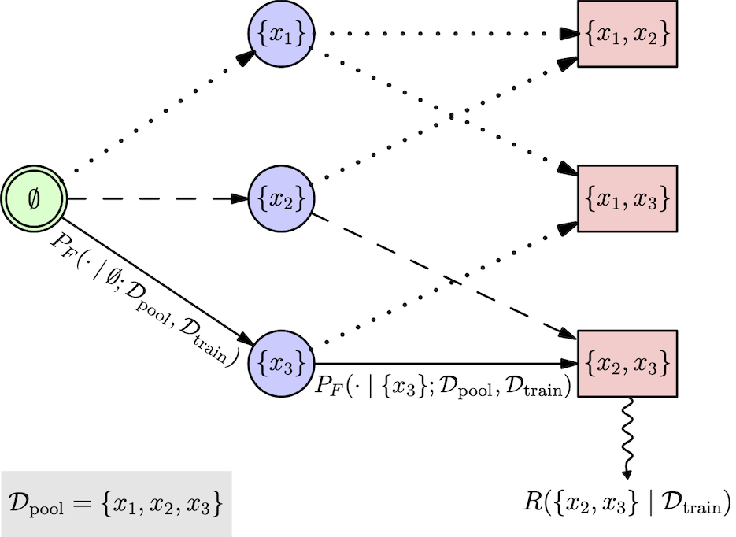

# BatchGFN



BatchGFN is a batch active learning method which uses a generative flow network trained to sample batches of points from a pool dataset proportional to a batch reward function.

The code in this repository was used in the ICML 2023 [SPIGM](https://spigmworkshop.github.io/) workshop paper *BatchGFN: Generative Flow Networks for Batch Active Learning*, Shreshth A. Malik, Salem Lahlou, Andrew Jesson, Moksh Jain, Nikolay Malkin, Tristan Deleu, Yoshua Bengio, Yarin Gal. ([Arxiv](https://arxiv.org/abs/2306.15058)).


## Installation

```.sh
git clone git@github.com:s-a-malik/batchgfn.git
cd batchgfn
conda env create -f environment.yml
conda activate batchgfn
```

If it fails [you might need to](https://stackoverflow.com/questions/69595700/could-not-build-wheels-for-tokenizers-which-is-required-to-install-pyproject-to)
```.sh
curl --proto '=https' --tlsv1.2 -sSf https://sh.rustup.rs | sh
source $HOME/.cargo/env
```

## Usage

Use command line arguments to set experimental variables. `scripts/main.py` is the main entry point for active learning experiments.

## Cite

If you found our work useful, please consider citing:

```
@article{malik2023batchgfn,
  title={BatchGFN: Generative Flow Networks for Batch Active Learning},
  author={Malik, Shreshth A and Lahlou, Salem and Jesson, Andrew and Jain, Moksh and Malkin, Nikolay and Deleu, Tristan and Bengio, Yoshua and Gal, Yarin},
  journal={arXiv preprint arXiv:2306.15058},
  year={2023}
}
```


Configs and logs are saved to wandb. Run `wandb login` before running, and `wandb offline` if you do not want to save logs online.
