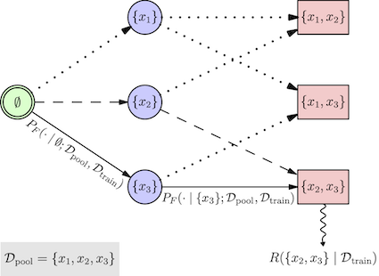

# BatchGFN



BatchGFN is a batch active learning method which uses a generative flow network trained to sample batches of points from a pool dataset proportional to a batch reward function.


## Installation

```.sh
conda env create -f environment.yml
conda activate batchgfn
```

If it fails [you might need to](https://stackoverflow.com/questions/69595700/could-not-build-wheels-for-tokenizers-which-is-required-to-install-pyproject-to)
```.sh
curl --proto '=https' --tlsv1.2 -sSf https://sh.rustup.rs | sh
source $HOME/.cargo/env
```

## Usage

Use command line arguments to set experimental variables. `scripts/main.py` is the main entry point for active learning experiments.

Configs and logs are saved to wandb. Run `wandb login` before running, and `wandb offline` if you do not want to save logs online.
